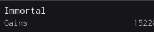
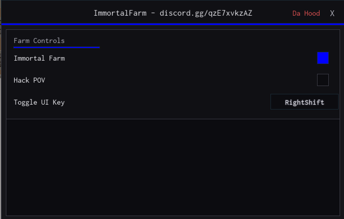

# :loudspeaker: Important Announcement :loudspeaker:

Hello everyone, I’ve got some exciting news to share! :tada:

Until now, I’ve never sold any scripts or UIs.  
This is a **brand-new release** and it’s officially available for the first time! :rocket:

:computer: **Where to get it:**  
The user interface is now available exclusively on my website:  
:point_right: [https://dacash.sellsn.io/](https://dacash.sellsn.io/)

:pray: **Special Thanks**  
Huge credit to **byte.warp** for their incredible help during development — this project wouldn’t have been possible without them.

:shield: **Current Status**  
- Works perfectly in a **private server** for now  
- Extremely fast and smooth performance  
- Coming soon for **public servers**  
- **Compatible with Mobile and PC**  
- **Supports all executors**  

## :framed_picture: Dynamic Counter Feature

One of the highlights of this update is the **dynamic counter**, shown below:  
It tracks your progress in real time and is **fully interactive**:  

- On **PC**, you can **toggle the menu** using a key of your choice.  
- You can **close the menu** safely using the cross in the top-left corner.  
- Pressing on the **counter opens the menu instantly**.  
- On **Mobile**, the UI automatically **adapts perfectly** for touch interactions.  

  

:repeat: **Updates**  
This script will be updated **regularly** with new features and improvements!  

:email: **Join our Discord**  
For support, updates, and discussions, join the official server:  
:point_right: [discord.gg/qzE7xvkzAZ](https://discord.gg/qzE7xvkzAZ)

## :framed_picture: UI Preview

Here is the full UI preview:

  

